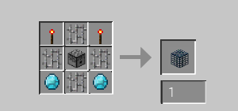
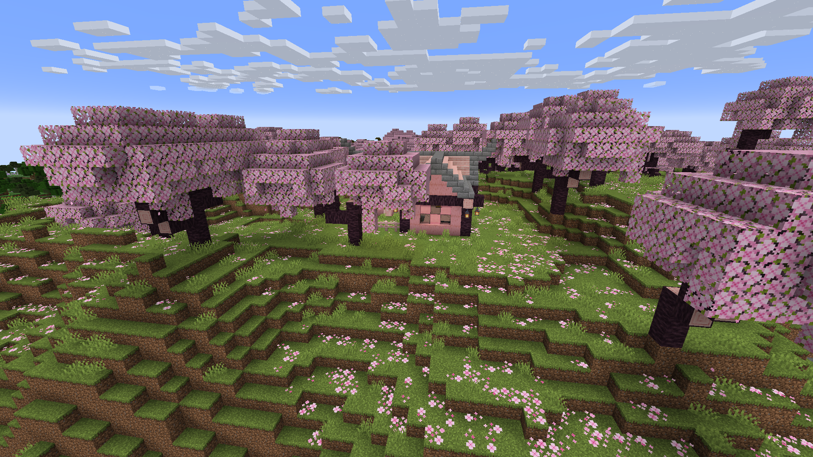
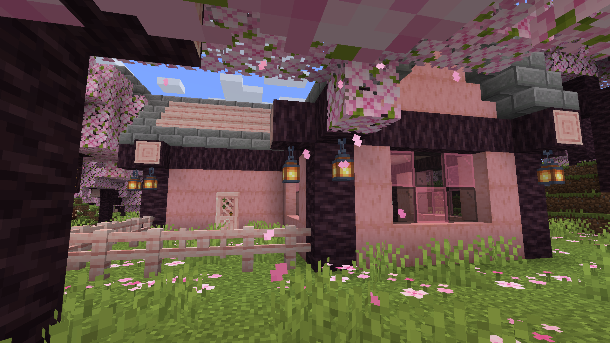
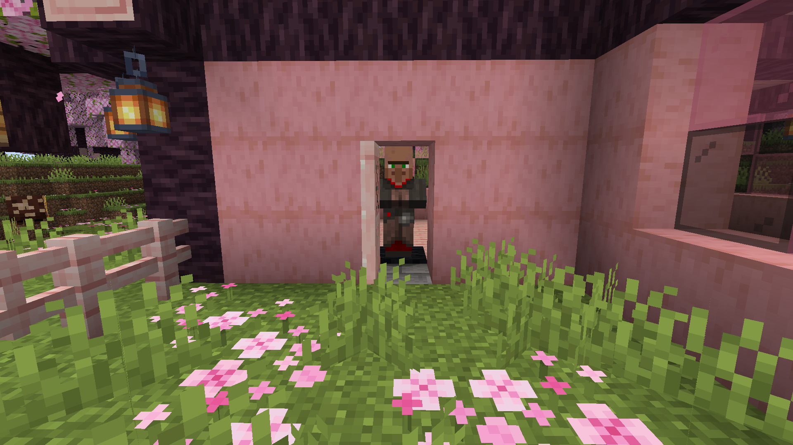
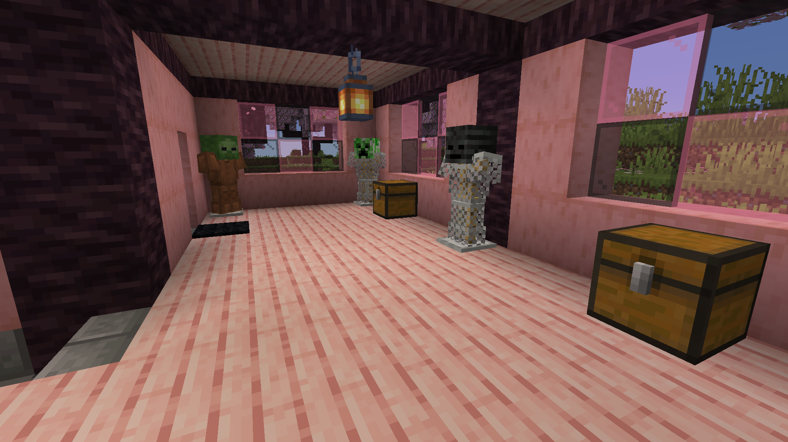
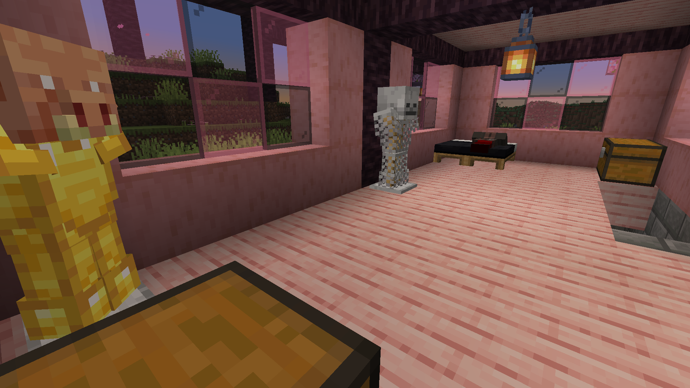
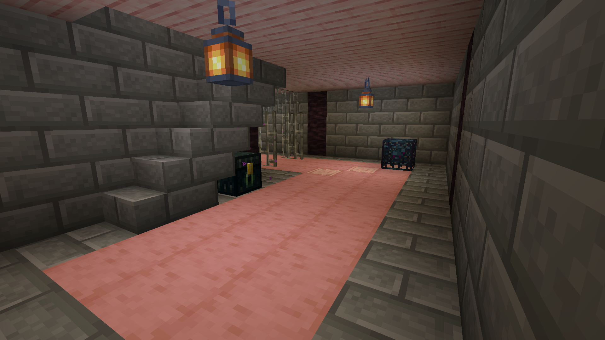
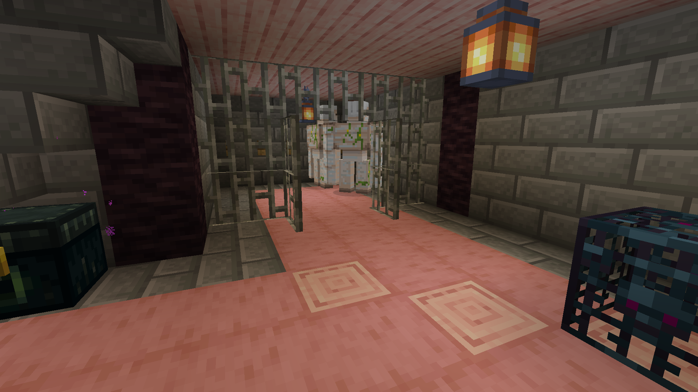

# Caveman's Buyable Mob Eggs (NeoForge)

A [NeoForge](https://neoforged.net/) mod for **Minecraft 1.21.1** that makes every mob spawn egg in the game buyable through a custom villager called the **Mob Wrangler**, and adds craftable mob spawners.

---

## Mob Wrangler Villager

- **Workstation:** Mob Spawner
- Trades refresh like a normal villager
- Most spawn eggs are available starting at Level 1, but you’ll need to cycle trades to find the egg you want

### Special Exceptions

- **Wither** and **Elder Guardian** spawn eggs — Always available at Level 4
- **Ender Dragon** spawn egg — Always available at Level 5

---

## Craftable Mob Spawners

Mob spawners are now craftable. The spawner’s mob type is set by inserting a spawn egg. This allows you to fully customize spawners without commands or creative mode.

### Mob Spawner Recipe

---

## Trade Options

### 🟢 Novice (Level 1)

*Cycle trades to find the spawn egg you want.*

| You give             | You get                |
| -------------------- | ---------------------- |
| 5 Emeralds + 1 Egg   | 1 Allay Spawn Egg      |
| 5 Emeralds + 1 Egg   | 1 Axolotl Spawn Egg    |
| 5 Emeralds + 1 Egg   | 1 Bat Spawn Egg        |
| 5 Emeralds + 1 Egg   | 1 Camel Spawn Egg      |
| 5 Emeralds + 1 Egg   | 1 Cat Spawn Egg        |
| 5 Emeralds + 1 Egg   | 1 Chicken Spawn Egg    |
| 5 Emeralds + 1 Egg   | 1 Cod Spawn Egg        |
| 5 Emeralds + 1 Egg   | 1 Cow Spawn Egg        |
| 5 Emeralds + 1 Egg   | 1 Donkey Spawn Egg     |
| 5 Emeralds + 1 Egg   | 1 Fox Spawn Egg        |
| 5 Emeralds + 1 Egg   | 1 Frog Spawn Egg       |
| 5 Emeralds + 1 Egg   | 1 Glow Squid Spawn Egg |
| 5 Emeralds + 1 Egg   | 1 Horse Spawn Egg      |
| 5 Emeralds + 1 Egg   | 1 Mooshroom Spawn Egg  |
| 5 Emeralds + 1 Egg   | 1 Mule Spawn Egg       |
| 5 Emeralds + 1 Egg   | 1 Ocelot Spawn Egg     |
| 5 Emeralds + 1 Egg   | 1 Panda Spawn Egg      |
| 5 Emeralds + 1 Egg   | 1 Parrot Spawn Egg     |
| 5 Emeralds + 1 Egg   | 1 Pig Spawn Egg        |
| 5 Emeralds + 1 Egg   | 1 Pufferfish Spawn Egg |
| 5 Emeralds + 1 Egg   | 1 Rabbit Spawn Egg      |
| 5 Emeralds + 1 Egg   | 1 Salmon Spawn Egg     |
| 5 Emeralds + 1 Egg   | 1 Sheep Spawn Egg      |
| 5 Emeralds + 1 Egg   | 1 Skeleton Horse Spawn Egg |
| 5 Emeralds + 1 Egg   | 1 Sniffer Spawn Egg    |
| 5 Emeralds + 1 Egg   | 1 Snow Golem Spawn Egg |
| 5 Emeralds + 1 Egg   | 1 Squid Spawn Egg      |
| 5 Emeralds + 1 Egg   | 1 Strider Spawn Egg    |
| 5 Emeralds + 1 Egg   | 1 Tadpole Spawn Egg    |
| 5 Emeralds + 1 Egg   | 1 Tropical Fish Spawn Egg |
| 5 Emeralds + 1 Egg   | 1 Turtle Spawn Egg     |
| 5 Emeralds + 1 Egg   | 1 Villager Spawn Egg   |
| 5 Emeralds + 1 Egg   | 1 Zombie Horse Spawn Egg |
| 5 Emeralds + 1 Egg   | 1 Blaze Spawn Egg      |
| 5 Emeralds + 1 Egg   | 1 Cave Spider Spawn Egg |
| 5 Emeralds + 1 Egg   | 1 Creeper Spawn Egg    |
| 5 Emeralds + 1 Egg   | 1 Drowned Spawn Egg    |
| 5 Emeralds + 1 Egg   | 1 Enderman Spawn Egg   |
| 5 Emeralds + 1 Egg   | 1 Endermite Spawn Egg  |
| 5 Emeralds + 1 Egg   | 1 Evoker Spawn Egg     |
| 5 Emeralds + 1 Egg   | 1 Ghast Spawn Egg      |
| 5 Emeralds + 1 Egg   | 1 Guardian Spawn Egg   |
| 5 Emeralds + 1 Egg   | 1 Hoglin Spawn Egg     |
| 5 Emeralds + 1 Egg   | 1 Husk Spawn Egg       |
| 5 Emeralds + 1 Egg   | 1 Magma Cube Spawn Egg |
| 5 Emeralds + 1 Egg   | 1 Phantom Spawn Egg    |
| 5 Emeralds + 1 Egg   | 1 Piglin Spawn Egg     |
| 5 Emeralds + 1 Egg   | 1 Piglin Brute Spawn Egg |
| 5 Emeralds + 1 Egg   | 1 Pillager Spawn Egg   |
| 5 Emeralds + 1 Egg   | 1 Ravager Spawn Egg    |
| 5 Emeralds + 1 Egg   | 1 Shulker Spawn Egg    |
| 5 Emeralds + 1 Egg   | 1 Silverfish Spawn Egg |
| 5 Emeralds + 1 Egg   | 1 Skeleton Spawn Egg   |
| 5 Emeralds + 1 Egg   | 1 Slime Spawn Egg      |
| 5 Emeralds + 1 Egg   | 1 Spider Spawn Egg     |
| 5 Emeralds + 1 Egg   | 1 Stray Spawn Egg      |
| 5 Emeralds + 1 Egg   | 1 Vex Spawn Egg        |
| 5 Emeralds + 1 Egg   | 1 Vindicator Spawn Egg |
| 5 Emeralds + 1 Egg   | 1 Witch Spawn Egg      |
| 5 Emeralds + 1 Egg   | 1 Wither Skeleton Spawn Egg |
| 5 Emeralds + 1 Egg   | 1 Zoglin Spawn Egg     |
| 5 Emeralds + 1 Egg   | 1 Zombie Spawn Egg     |
| 5 Emeralds + 1 Egg   | 1 Zombie Villager Spawn Egg |
| 5 Emeralds + 1 Egg   | 1 Zombified Piglin Spawn Egg |

### 🔵 Apprentice (Level 2)

| You give           | You get            |
| ------------------ | ------------------ |
| 4 Eggs             | 1 Emerald          |
| 1 Mob Spawner       | 3 Emerald Blocks   |

### 🟡 Journeyman (Level 3)

| You give             | You get        |
| -------------------- | -------------- |
| 3 Emeralds           | 8 Eggs         |
| 10 Emerald Blocks    | 1 Mob Spawner  |

### 🟠 Expert (Level 4)

| You give               | You get                    |
| ---------------------- | -------------------------- |
| 5 Emeralds + 1 Egg     | 1 Elder Guardian Spawn Egg |
| 5 Emeralds + 1 Egg     | 1 Wither Spawn Egg         |

### 🔴 Master (Level 5)

| You give               | You get                   |
| ---------------------- | ------------------------- |
| 5 Emeralds + 1 Egg     | 1 Ender Dragon Spawn Egg  |

---

## Screenshots

---

## Requirements & Installation

- **Minecraft** 1.21.1 · **NeoForge** 21.1.219 (or compatible)

1. Install [NeoForge](https://neoforged.net/) for 1.21.1.
2. Download the latest JAR from [releases](https://github.com/CavemanTechandGamming/Caveman-s-Buyable-Mob-Eggs-NeoForge/releases).
3. Put the JAR in your `mods` folder.

---

## Links & License

- [GitHub](https://github.com/CavemanTechandGamming/Caveman-s-Buyable-Mob-Eggs-NeoForge) · [NeoForge docs](https://docs.neoforged.net/)
- This project uses official Mojang mapping names; see the [NeoForm mapping license](https://github.com/NeoForged/NeoForm/blob/main/Mojang.md).
- [LICENSE](LICENSE)
